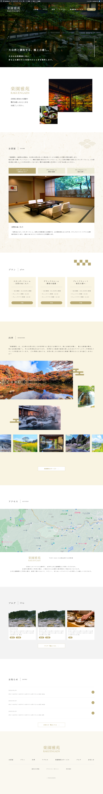
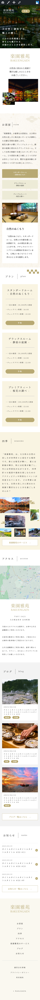
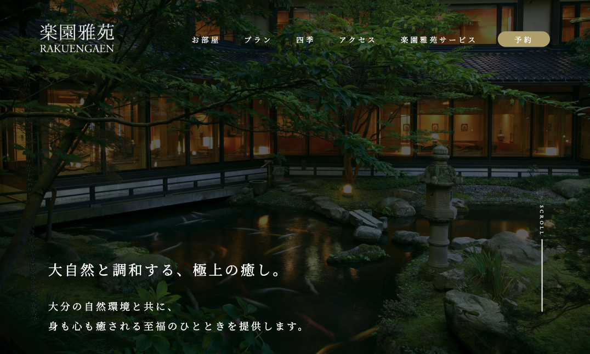
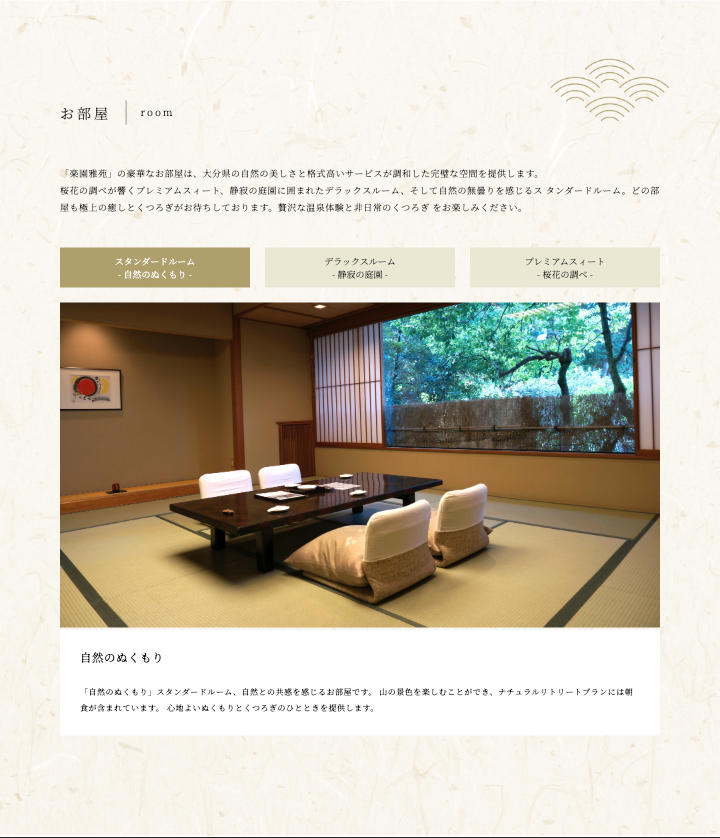
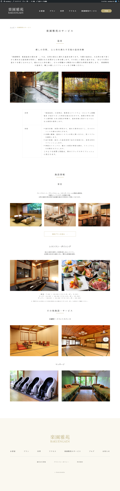
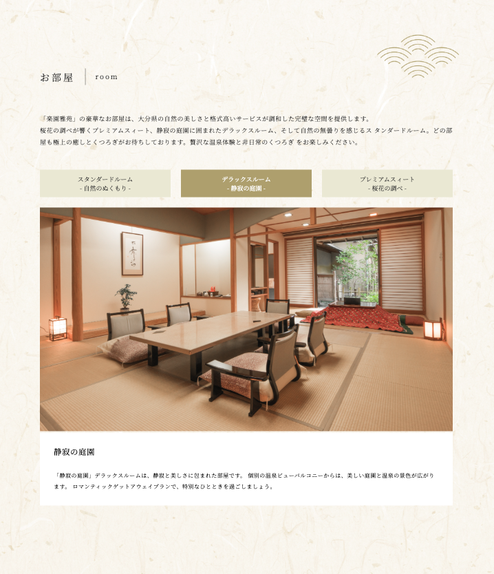
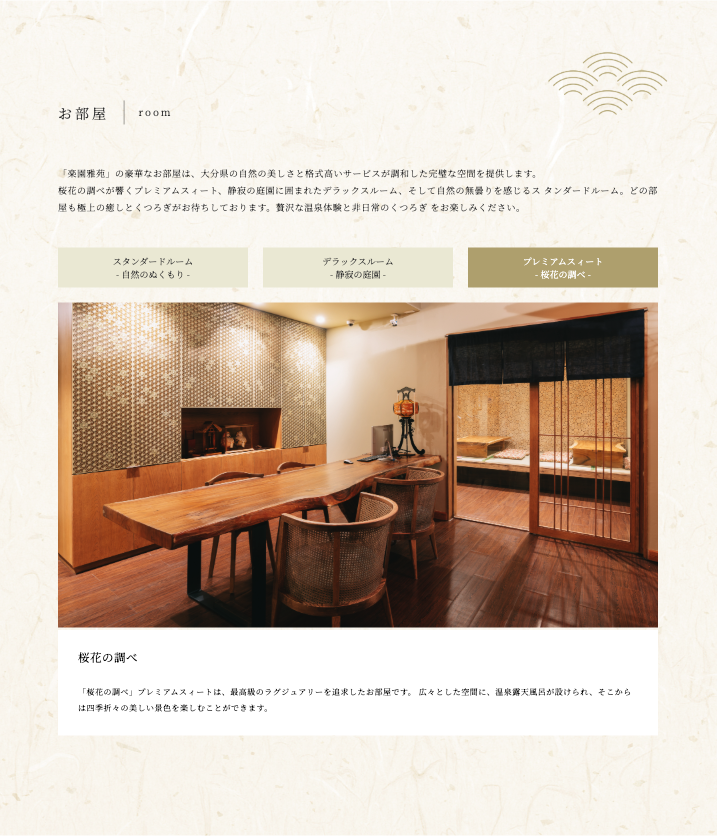
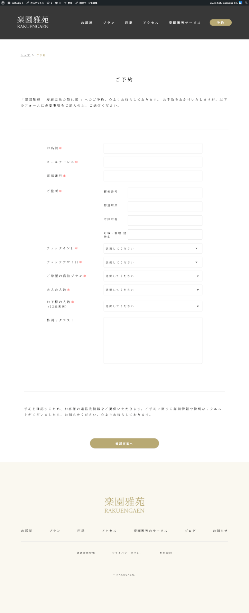
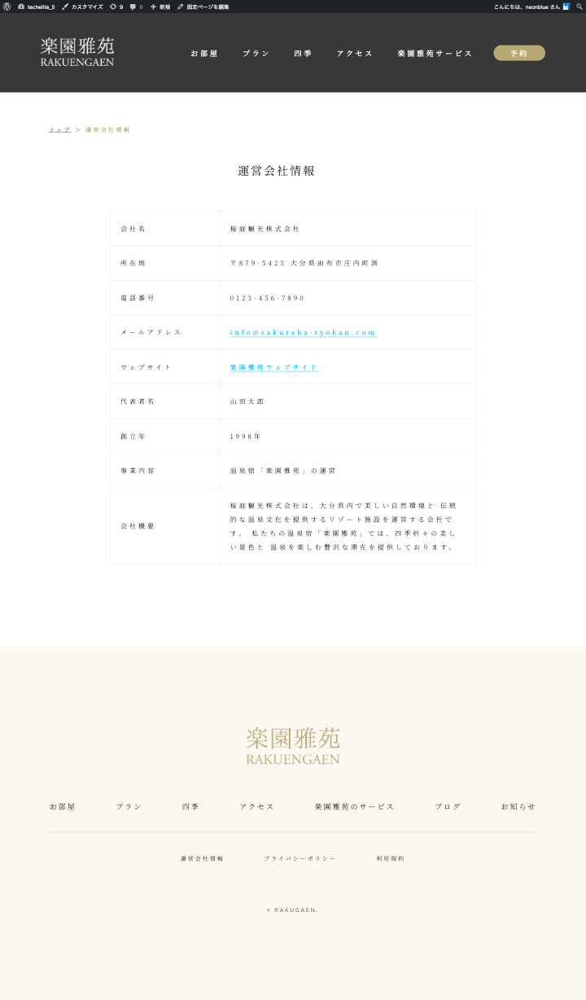
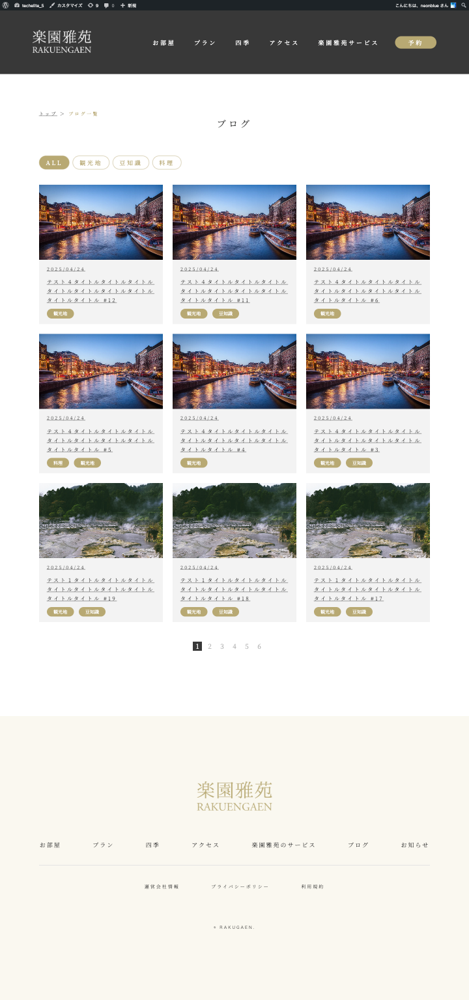

# 楽園雅苑（RAKUENGAEN）- 温泉旅館WordPressサイト

## 📝 プロジェクト概要
テックエリートHP制作コース最終課題として制作した、温泉旅館「楽園雅苑」のWordPressサイトです。Figmaデザインをもとに完全オリジナルテーマで開発し、機能的なWordPressサイトとして実装しました。

## 🛠️ 技術スタック
- **CMS**: WordPress
- **言語**: PHP, HTML5, CSS3, JavaScript
- **テーマ**: 完全オリジナル開発
- **レスポンシブ**: PC・タブレット・スマートフォン対応

## ✨ 主要機能
- 🏨 **客室紹介** - タブ切り替えによる3タイプの客室表示
- 🎬 **自動スライドショー** - 美しいロケーション画像の自動表示
- 📱 **レスポンシブデザイン** - PC・タブレット・スマートフォン対応
- 🍽️ **ハンバーガーメニュー** - モバイル向けナビゲーション
- 📝 **予約システム** - 使いやすい予約フォーム
- 📰 **ブログ、お知らせ機能** - 旅館情報等の発信

## 🖼️ スクリーンショット

### トップページ
| PC版 | スマートフォン版 |
|------|------------------|
|  |  |

### 主要セクション
| KVセクション | 客室案内 | サービス |
|-------------|----------|----------|
|  |  |  |

### 客室タイプ
| スタンダードルーム | デラックスルーム | プレミアムスイート |
|-------------------|------------------|-------------------|
|  |  |  |

### その他のページ
| 予約ページ | 会社概要 | ブログ |
|------------|----------|--------|
|  |  |  |

## 🎥 動的機能デモ

### タブ切り替え機能


### 自動スライドショー


### レスポンシブメニュー


## 📁 ファイル構成
```
TECHELITE_5/
├── assets/
│   ├── css/
│   │   └── style.css
│   ├── img/
│   └── js/
│       └── index.js
├── *.php (テーマファイル)
└── functions.php
```

---

**担当範囲**: コーディング・WordPress実装

> テックエリートHP制作コース最終課題として制作
